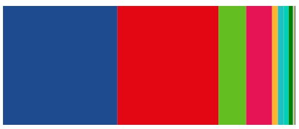

# Single bar

So the boss was not happy with a Barchart, we must choose a chart type whereis easier to check the relative weight of each political party compared with the total of seats available.

Maybe a chart like this could help:



<!-- Click here to check the sample live: [Codesandbox](https://codesandbox.io/s/flamboyant-forest-sxyq0) -->

Let's give a try.

## Steps

- This example will start from 01-bar-chart, let's copy it to a new folder and execute

```bash
npm install
```

- Since x axis will be dynamic (depending on the seats assigned for each party)
  let's calcualte the XScale (seats to pixels).

First let's remove how we calculated the fixed bar width (now height will be fixed):

```diff
- const politicalPartiesCount = resultCollectionSpainJul23.length;
- const barPadding = 5; // We could calculate this value as well
- const barWidth =
-  (chartDimensions.width - barPadding * politicalPartiesCount) /
-  politicalPartiesCount;
+ const barHeight = 200; // We could calculate this based on svg height
```

```diff
- const maxNumberSeats = resultCollectionSpainJul23.reduce(
-   (max, item) => (item.seats > max ? item.seats : max),
-   0
- );
...
- const yScale = d3
-   .scaleLinear()
-  .domain([0, maxNumberSeats])
-  .range([0, chartDimensions.height]);

+ const totalNumberSeats = resultCollectionSpainJul23.reduce(
+  (sum, item) => sum + item.seats,
+  0
+ );

+ const xScale = d3
+  .scaleLinear()
+  .domain([0, totalNumberSeats])
+  .range([0, chartDimensions.width]);
```

- Let's add the rectangles, this time, we will calculate the width dinamically and
  the height will be fixed. We have one challenge here... each bar (PSOE, PP, ...)
  has to start when the previous one finished, in order to solve this we are going
  to use an accumulator (in the next example we will learn how to solve
  this using a layout)

```diff
+ let currentXPosition = 0;

chartGroup
  .selectAll("rect")
  .data(resultCollectionSpainJul23)
  .enter()
  .append("rect")
-  .attr("width", barWidth)
+  .attr("width", (d) => xScale(d.seats))
-  .attr("height", (d) => yScale(d.seats))
+  .attr("height", barHeight)
-  .attr("x", (d, i) => i * (barWidth + barPadding))
+  .attr("x", (d) => {
+    const position = currentXPosition;
+    currentXPosition += xScale(d.seats);
+    return position;
+  })

-  .attr("y", (d) => chartDimensions.height - yScale(d.seats))
+  .attr("y", () => chartDimensions.height - barHeight)
  .attr("fill", (d) => partiesColorScale(d.party));
```

- Let's run this code now

```bash
npm start
```

## Excercise

Couldn't it be cool to add an indicator showing how many seat are needed to
get overall majority? Something like:

Tips:

- The number of seats to get overall majority is half of the aviable seat + 1.
- You can use the xScale to get the exact position where to draw a line.
- you can draw a vertical line (check svg attribute to give it the right
  widht and color).

¡That's all!

## About Basefactor + Lemoncode

We are an innovating team of Javascript experts, passionate about turning your ideas into robust products.

[Basefactor, consultancy by Lemoncode](http://www.basefactor.com) provides consultancy and coaching services.

[Lemoncode](http://lemoncode.net/services/en/#en-home) provides training services.

For the LATAM/Spanish audience we are running an Online Front End Master degree, more info: <http://lemoncode.net/master-frontend>
