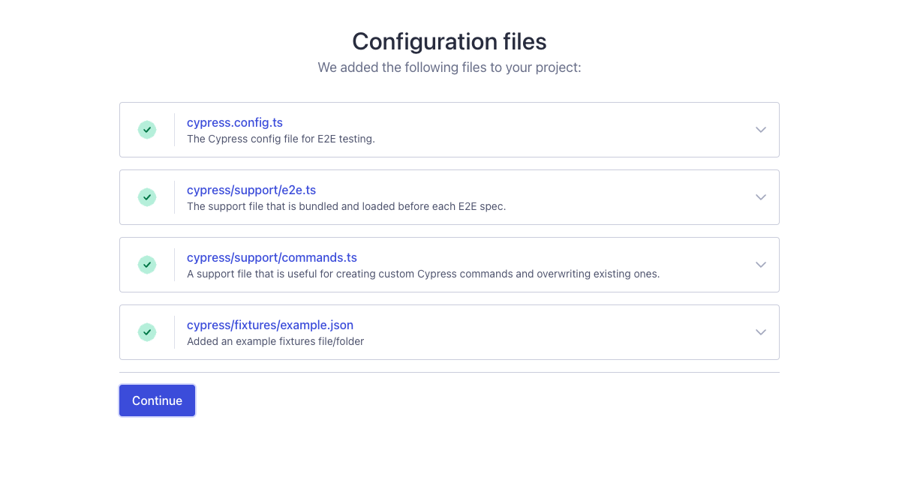
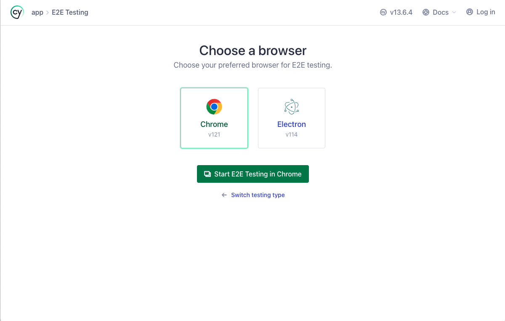
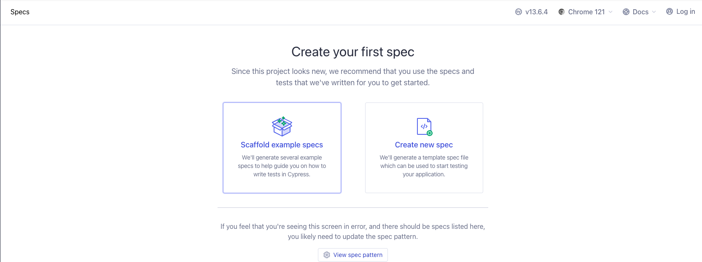

# 01 Config

In this example we are going to add a basic setup needed to support end to end testing with Cypress.

We will start from `00-boilerplate`.

# Steps to build it

- `npm install` to install previous sample packages:

```bash
npm install
```

# Libraries

- We are going to install the main library which we base all our unit tests, [Cypress](https://www.cypress.io/).

```bash
npm install cypress --save-dev
```

# Config

- We can just add cypress command to scripts and running it:

### ./package.json

```diff
"scripts": {
...
    "postinstall": "cd ./server && npm install",
+   "test:e2e": "cypress open"
  },
```

- Run it:

```bash
npm run test:e2e
```

After running this command a new prompt opens:


Select `E2E Testing`, Cypress will show us what files are going to be created:



Click `Continue`, Cypress will show us different browser options to run our tests:



Pick `Chrome`, after that Cypress will prompt us to scaffold examples or create a new spec:



From here we will go in our own, cut the Cypress server by closing the opened browser windows, or from console using `Ctrl + C`

- Let's remove `downloads`, `fixtures/example.json`, `support/commands.ts` and clear `support/e2e.ts` file content.

> We will use `support/e2e.ts`

- Create `./cypress/e2e` folder

- Add login spec inside `e2e` folder:

### ./cypress/e2e/login.spec.js

```javascript
describe('Login specs', () => {
  it('visit the login page', () => {
    cy.visit('http://localhost:8080');
  });
});
```

- Update specPattern (by default is `cypress/e2e/**/*.cy.{js,jsx,ts,tsx}`):

### ./cypress.config.ts

```diff
import { defineConfig } from "cypress";

export default defineConfig({
  e2e: {
-   setupNodeEvents(on, config) {
-     // implement node event listeners here
-   },
+   specPattern: 'cypress/e2e/**/*.spec.{js,jsx,ts,tsx}',
  },
});
```

> [Config API](https://docs.cypress.io/guides/references/configuration#Testing-Type-Specific-Options)

- An important note is that we need to running the app to execute the e2e tests:

### ./package.json

```diff
"scripts": {
...
-   "test:e2e": "cypress open"
+   "test:e2e": "npm start -- start:e2e",
+   "start:e2e": "cypress open"
  },
```

- Running:

```bash
npm run test:e2e

```

- So far so good, we can add the base app url in `cypress.config.ts` to avoid repeat it in whole tests:

### ./cypress.config.ts

```diff
import { defineConfig } from "cypress";

export default defineConfig({
  e2e: {
+   baseUrl: 'http://localhost:8080/#',
    specPattern: 'cypress/e2e/**/*.spec.{js,jsx,ts,tsx}',
  },
});
```

> You can see more info [here](https://docs.cypress.io/guides/references/configuration.html#Options)

### ./cypress/e2e/login.spec.js

```diff
describe('Login specs', () => {
  it('visit the login page', () => {
-   cy.visit('http://localhost:8080');
+   cy.visit('/');
  });
});

```

- Could we work with Typescript? If we rename spec to `.ts`:

_./cypress/e2e/login.spec.js_ -> _./cypress/e2e/login.spec.ts_

- For now, it's not neccessary but advisable to add the `tsconfig.json` file inside cypress folder:

### ./cypress/tsconfig.json

```json
{
  "compilerOptions": {
    "target": "es5",
    "lib": ["es5", "dom"],
    "types": ["cypress", "node"]
  },
  "include": ["**/*.ts"]
}

```

> You can see more info [here](https://docs.cypress.io/guides/tooling/typescript-support#Configure-tsconfig-json)

- Now it's fully supported. Let's try another spec:

### ./cypress/e2e/login.spec.ts

```diff
describe('Login specs', () => {
  it('visit the login page', () => {
    cy.visit('/');
  });

+ it('should name input has the focus when it clicks on it', () => {
+   // Arrange

+   // Act
+   cy.visit('/');
+   cy.get('input[name="name"]').click();

+   // Assert
+   cy.get('input[name="name"]').should('have.focus');
+ });
});

```

# About Basefactor + Lemoncode

We are an innovating team of Javascript experts, passionate about turning your ideas into robust products.

[Basefactor, consultancy by Lemoncode](http://www.basefactor.com) provides consultancy and coaching services.

[Lemoncode](http://lemoncode.net/services/en/#en-home) provides training services.

For the LATAM/Spanish audience we are running an Online Front End Master degree, more info: http://lemoncode.net/master-frontend
